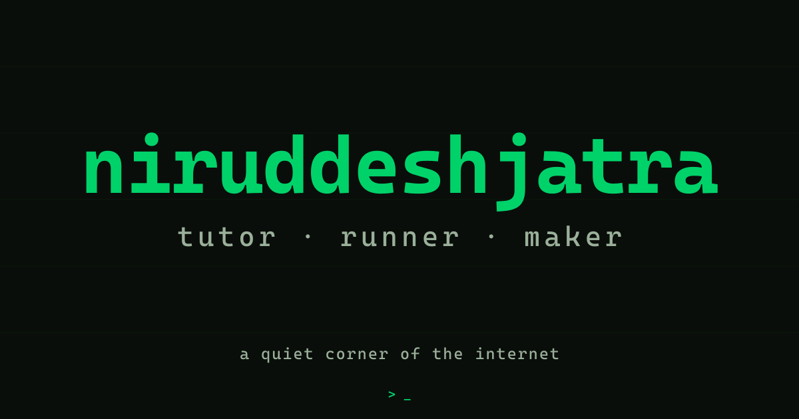
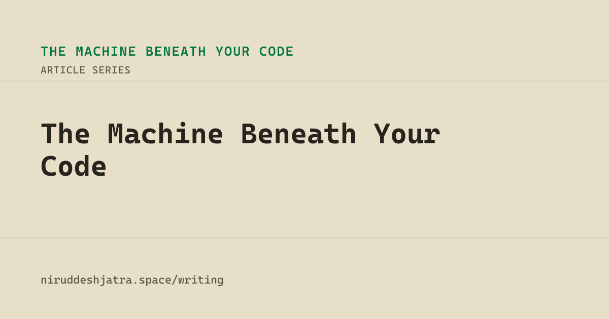
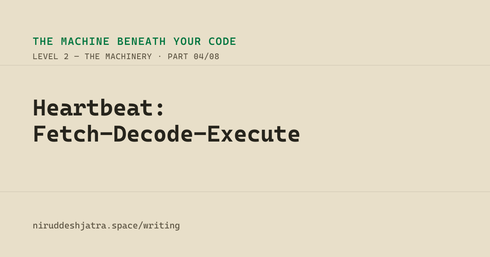
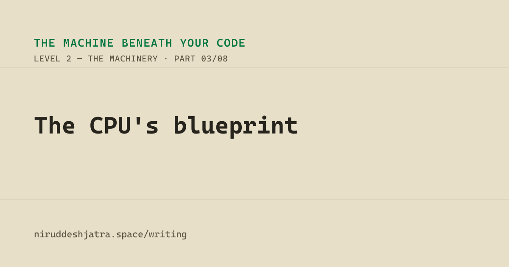
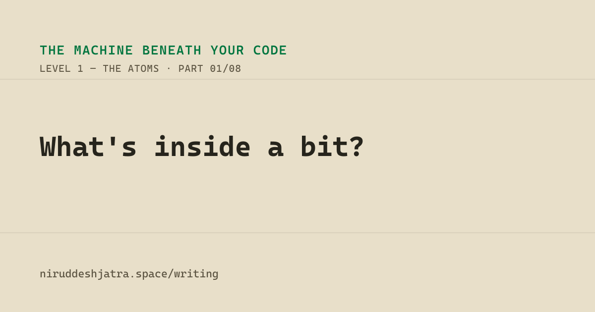
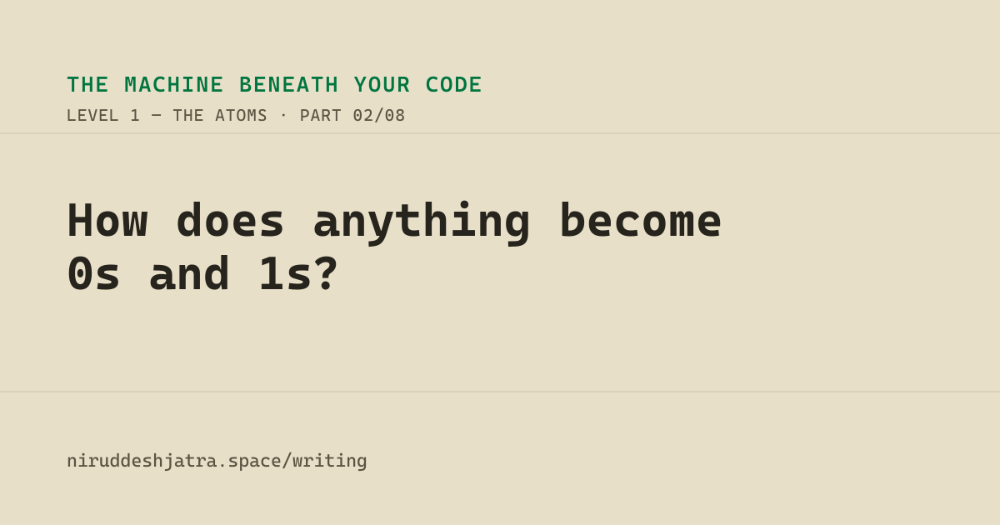

<br />

# nasiful-coder-space

**A developer portfolio built to feel like a workspace, not a resume.**

VS Code shell. Interactive terminal. Bilingual CS writing. Deployed as a prerendered static site.

[](https://niruddeshjatra.space/)
[](https://react.dev/)
[](https://www.typescriptlang.org/)
[](https://vitejs.dev/)
[](https://tailwindcss.com/)

---

## Overview

The UI is modeled after VS Code — file explorer on the left, editor pane in the center, terminal at the bottom. Navigation happens through files, not nav links. Every section of my life (writing, running, games, field notes) is a file in a tree.

The writing section runs a separate design system: **"The Paper Oscilloscope"** — warm aged-paper aesthetic, outside the VS Code shell entirely. It hosts a bilingual (বাংলা / English) series on how computers actually work, with interactive widgets built in plain React: transistors, clock cycles, instruction pipelines, adders.

The whole thing deploys as a static site. A custom prerender pipeline (headless Chrome via `puppeteer-core`) crawls every route post-build and writes crawler-visible HTML with full meta — so Facebook, LinkedIn, and search crawlers get real `og:` tags without running JavaScript.

---

## Screenshots

<table>
  <tr>
    <td align="center" width="50%">
      
      <sub><b>Homepage</b> — terminal intro, VS Code shell, matrix backdrop</sub>
    </td>
    <td align="center" width="50%">
      
      <sub><b>Article Series Hub</b> — The Machine Beneath Your Code</sub>
    </td>
  </tr>
  <tr>
    <td align="center" width="50%">
      
      <sub><b>Tech Article</b> — Heartbeat: Fetch-Decode-Execute (Paper Oscilloscope design system)</sub>
    </td>
    <td align="center" width="50%">
      
      <sub><b>Tech Article</b> — The CPU's Blueprint</sub>
    </td>
  </tr>
  <tr>
    <td align="center" width="50%">
      
      <sub><b>Tech Article</b> — What's Inside a Bit</sub>
    </td>
    <td align="center" width="50%">
      
      <sub><b>Tech Article</b> — How Does Anything Become Bits</sub>
    </td>
  </tr>
</table>

---

## Features

- **VS Code shell** — file explorer, editor pane, interactive terminal with custom commands (`help`, `ls`, `cd`, `open`, `clear`, `whoami`)
- **Command palette** — `Cmd+P` opens file navigation, `Cmd+Shift+P` opens commands; built with `cmdk`
- **Paper Oscilloscope** — a separate article design system with aged-paper typography, inline interactive instruments (transistors, adders, clock visualizers, pipeline demos), and bilingual toggle
- **Bilingual articles** — Bangla/English toggle with no URL change; Bengali numerals via `bd()` helper; `lang="bn"` for correct font rendering; SEO title/description updates dynamically
- **SSG prerendering** — `puppeteer-core` crawls every route post-build; CI hard-fails if no browser resolves (catches silent meta-less deploys)
- **Build-time OG images** — `sharp` generates 1200×630 `og/<slug>.png` per published article at build time — no manual step
- **Build-time sitemap** — `scripts/generate-sitemap.mjs` writes `sitemap.xml` + `robots.txt` with explicit hreflang pairing
- **Theme switching** — dark / light / system via `next-themes`; phosphor green accent on dark, ink-on-paper for articles
- **Matrix background** — ambient katakana/digit rain with per-section opacity tuning; GPU-composited on mobile
- **Mobile layout** — slide-in file drawer + slide-up terminal sheet; visual viewport API for keyboard offset; no separate mobile shell
- **Portal transitions** — scramble + cloud-dissolve animation between site areas via GSAP (`firePortal()` singleton)
- **Structured data** — JSON-LD `WebSite`, `Person`, `Article` schemas per route via `react-helmet-async`

---

## Tech Stack

| Layer | Choice |
|-------|--------|
| Framework | React 19 + TypeScript 5 |
| Build tool | Vite 5 + `@vitejs/plugin-legacy` (spread — plugin returns `Plugin[]`) |
| Styling | Tailwind CSS 3 + Radix UI + shadcn/ui |
| Animation | GSAP 3 |
| Routing | React Router v6 |
| State / async | TanStack Query v5 |
| Forms | React Hook Form + Zod |
| SEO | `react-helmet-async` + custom prerender pipeline |
| Image gen | `sharp` (OG images + favicons at build time) |
| Prerender | `puppeteer-core` + `@sparticuz/chromium` (serverless fallback) |
| Deploy | Vercel — apex domain canonical, `www` → apex 301 redirect |

**Article instruments** are plain React — no DC runtime, no template engine, no external dependencies.

---

## Key Dependencies

| Package | Purpose |
|---------|---------|
| `gsap` | Portal scramble + cloud-dissolve transitions |
| `cmdk` | Command palette (`Cmd+P` / `Cmd+Shift+P`) |
| `next-themes` | Dark / light / system theme provider |
| `react-helmet-async` | Per-route `<head>` management (title, meta, JSON-LD) |
| `react-router-dom` | Client-side routing + catch-all 404 via `forceSection` |
| `@tanstack/react-query` | Async state, server data fetching |
| `react-hook-form` + `zod` | Contact form validation |
| `react-resizable-panels` | Editor / terminal panel layout |
| `vaul` | Mobile terminal slide-up sheet |
| `sharp` | Build-time OG + favicon image generation |
| `puppeteer-core` | Post-build SSG prerendering |
| `@sparticuz/chromium` | Serverless-compatible Chrome binary (Vercel builds) |
| `tsx` | Runs `.ts` build scripts (`generate-og`, `generate-sitemap`) |
| `recharts` | Charts (if/when analytics are surfaced) |
| `lucide-react` + `react-icons` | Icon sets |

---

## Local Setup

```bash
# Clone and install
git clone https://github.com/NiruddeshJatra/nasiful-coder-space.git
cd nasiful-coder-space
npm install

# Start dev server
npm run dev
# → http://localhost:5173
```

**Full production build** (generates OG images, favicons, sitemap, runs Vite, prerenders all routes):

```bash
npm run build
npm run preview
```

Individual build steps (if iterating):

```bash
npm run generate-og        # → public/og-image.png + public/og/<slug>.png
npm run generate-favicons  # → public/favicon-*.png, apple-touch-icon, etc.
npm run generate-sitemap   # → public/sitemap.xml + public/robots.txt
npm run prerender          # → crawls dist/ and writes static HTML per route
```

Prerender with a specific Chrome binary (local dev):

```bash
CHROME_PATH="/path/to/chrome" npm run prerender
```

Type check and lint:

```bash
npx tsc --noEmit
npm run lint
```

> **Note on prerender in CI** — the build hard-fails if no browser resolves (`CHROME_PATH`, desktop Chrome, or `@sparticuz/chromium`). This is intentional: a silent failure would ship meta-less HTML.

---

## Stats

<p>
  
  
</p>

<p>
  
</p>

---

## Stack (Personal)

**Backend**


**Frontend**


**Data**


**Infra & Tools**


---

## Links

[](https://niruddeshjatra.space/)
[](https://niruddeshjatra.space/writing/tech-articles)
[](https://arczero.app/)
[](https://www.linkedin.com/in/nasiful-alam/)
[](mailto:nasif@niruddeshjatra.space)
